# Canonical derivation and observer-only viewer pipeline

Status: explanatory architecture map for draft PR #215. Nodes marked
`CURRENT` describe implemented behavior. Nodes marked `FUTURE` remain blocked
until their named authorities exist. This page explains dependency direction;
it is not a physical-admission artifact. The executable receipts, semantic
checkers, and sealed capabilities remain authoritative.

```mermaid
flowchart TB

    %% ============================================================
    %% UNIVERSAL ADMISSION LAW
    %% ============================================================

    subgraph ADMISSION["A. Universal causal-admission law applied at every rung"]
        direction LR

        PROPOSAL["Proposed quantity, law,<br/>measure, mechanism, or field"]
        DERIVE["Derive first<br/>Exact algebra, invariants,<br/>conservation, and ancestry"]
        DERIVED["Exact derivation receipt"]
        PI["Buckingham Pi analysis<br/>Dimensionless structure only;<br/>not physical closure"]
        GAP["Gap Law<br/>Includes typed Chaos Protocol"]
        CHAOS["Chaos disposition<br/>Resolved trajectory, measure,<br/>mixed regime, or refusal"]
        RESIDUAL["Residual Law<br/>Identify only irreducible remainder"]
        SLOT{"Exactly one justified<br/>residual slot?"}
        EVIDENCE["Evidence and citations<br/>Custody support only;<br/>never authority by themselves"]
        CANDIDATE["Candidate admitted leaf"]
        CHECKER["Semantic checker<br/>Floor and schema binding<br/>Dependency ancestry<br/>Validity domain<br/>Global conservation<br/>Deterministic resource bounds<br/>Replay identity"]
        AUTHORITY["Sealed content-bound<br/>causal authority"]
        LAW_REFUSAL["Typed refusal<br/>No default, calibration,<br/>or familiar substitute"]

        PROPOSAL --> DERIVE
        DERIVE -->|"Derivation closes"| DERIVED
        DERIVE -->|"All derivations exhausted"| PI
        PI --> GAP
        GAP --> CHAOS
        CHAOS --> RESIDUAL
        RESIDUAL --> SLOT
        EVIDENCE -. "Supports review" .-> SLOT

        SLOT -->|"Yes, with complete evidence"| CANDIDATE
        SLOT -->|"No, ambiguous, or unsupported"| LAW_REFUSAL

        DERIVED --> CHECKER
        CANDIDATE --> CHECKER
        CHECKER -->|"Pass"| AUTHORITY
        CHECKER -->|"Fail"| LAW_REFUSAL
    end

    %% ============================================================
    %% FLOOR AND STAGE 1
    %% ============================================================

    subgraph FLOOR_STAGE1["B. Absolute floor and stellar-system derivation"]
        direction TB

        SI["Exact SI representation definitions<br/>Engine coordinates only<br/>No provenance mark or physical freedom"]
        FLOOR["Sealed absolute physics floor<br/>alpha, G, and m_e<br/>Three Universal measured entries"]
        LEDGER["Auto-generated accounting census<br/>Four tiers by seven provenance marks<br/>Reports authority; never creates it"]
        RUN["run_planet<br/>Only accepted input: sealed floor"]
        AUDITED["AuditedFloorView<br/>Exact typed magnitudes plus<br/>independent floor-authority digest"]
        EPS0["Derived example: eps_0<br/>Exact ancestry from floor plus<br/>representation definitions"]

        FLOOR --> LEDGER
        FLOOR --> RUN
        RUN --> AUDITED
        SI -. "Coordinate representation only" .-> AUDITED
        AUDITED --> EPS0

        STRUCTURE["Value-free stellar structure v2<br/>Open components, species, coordinates,<br/>dimensions, sectors, regimes,<br/>histories, and classifications"]
        CENSUS["Exact dimensional census v4<br/>Non-admitting diagnostic<br/>closure_effect = none<br/>coverage_claim = false"]
        SPECIES_ANALYSIS["Species derivation analysis v1<br/>m_e is a mass-coordinate anchor only<br/>Zero members, zero support,<br/>no value, no residual slot"]
        CURRENT_PROOFS["CURRENT production resolver<br/>Joint physical measure = None<br/>Coordinate law = None"]
        CURRENT_REFUSAL["CURRENT Stage 1 refusal<br/>stellar_birth.realization_measure<br/>Both open leaves remain visible"]

        AUDITED --> STRUCTURE
        STRUCTURE -. "Describes possible carriers" .-> CENSUS
        AUDITED -. "Binds analysis" .-> CENSUS
        STRUCTURE -. "Binds analysis" .-> SPECIES_ANALYSIS
        AUDITED -. "Binds exact m_e anchor" .-> SPECIES_ANALYSIS

        CURRENT_PROOFS --> CURRENT_REFUSAL
        CENSUS -. "Attached as non-admitting analysis" .-> CURRENT_REFUSAL
        SPECIES_ANALYSIS -. "Attached as non-admitting analysis" .-> CURRENT_REFUSAL

        DESCRIPTOR["FUTURE complete species-state<br/>descriptor and semantic checker<br/>Identity, mass, charge, state, sector,<br/>validity, ancestry, and resource bounds"]
        REGISTRY["FUTURE realized species registry<br/>Complete lawful membership<br/>Familiarity-independent"]
        MECHANISMS["FUTURE admitted mechanism set<br/>Thermal, opacity, EOS, collapse,<br/>transport, spectra, topology,<br/>conservation, and validity laws"]
        JOINT["FUTURE correlation-preserving<br/>joint physical measure proof"]
        COORDINATE["FUTURE realization-coordinate law<br/>Total over joint support<br/>Measure-consistent push-forward<br/>Ordering and presentation independent"]
        BOTH["Conjunction of both opaque,<br/>repository-owned Stage 1 proofs"]
        DRAW["Internally minted realization coordinate<br/>Replay identity recorded<br/>No caller seed or desired outcome"]
        SUPPORT["Conditioned species-state support<br/>Bound to joint measure and coordinate<br/>Explicit zero and sparse semantics"]
        MEAN_MASS["Exact mean free-particle mass<br/>Exact rational reduction over<br/>complete verified support"]
        PROJECTION["Checked integer projection<br/>Derived finite range and scale<br/>Explicit rounding and overflow refusal<br/>Q32.32 only where proven"]
        THERMAL["Coupled gas and dust thermal balance<br/>Residual system plus Chaos Protocol"]
        EOS["Equation of state and phase closure"]
        COLLAPSE["Collapse and fragmentation measure"]
        HISTORIES["Material mass, position,<br/>velocity, and lineage histories"]
        ANGULAR["Angular-momentum transport<br/>and conservation"]
        MULTICENTER["Multicenter binding,<br/>circularization, and multiplicity"]
        SPECTRAL["Radiative and spectral closure"]
        DISK["Persistent star, disk,<br/>fragment, and embryo state"]
        SYSTEM["Completed Stage 1<br/>stellar-system state"]

        AUDITED --> DESCRIPTOR
        STRUCTURE --> DESCRIPTOR
        DESCRIPTOR --> REGISTRY
        REGISTRY --> MECHANISMS
        AUDITED --> MECHANISMS

        REGISTRY --> JOINT
        MECHANISMS --> JOINT
        AUDITED --> JOINT

        JOINT --> COORDINATE
        AUDITED --> COORDINATE

        JOINT --> BOTH
        COORDINATE --> BOTH
        BOTH --> DRAW

        DRAW --> SUPPORT
        REGISTRY --> SUPPORT
        SUPPORT --> MEAN_MASS
        MEAN_MASS --> PROJECTION
        PROJECTION --> THERMAL
        MECHANISMS --> THERMAL
        DRAW --> THERMAL

        THERMAL --> EOS
        EOS --> COLLAPSE
        COLLAPSE --> HISTORIES
        HISTORIES --> ANGULAR
        ANGULAR --> MULTICENTER
        MULTICENTER --> SPECTRAL
        SPECTRAL --> DISK
        DISK --> SYSTEM
    end

    AUTHORITY -. "Required for every future causal arrow" .-> DESCRIPTOR
    AUTHORITY -. "Required for every future causal arrow" .-> MECHANISMS
    LAW_REFUSAL --> CURRENT_REFUSAL

    %% ============================================================
    %% PLANETARY CHAIN
    %% ============================================================

    subgraph PLANET_CHAIN["C. Derived stellar system to complete immutable planet snapshot"]
        direction LR

        STAGE2["Stage 2<br/>System assembly and composition<br/>Body identity, phases, inventories,<br/>mass and angular momentum"]
        STAGE3["Stage 3<br/>Orbital, secular, relativistic,<br/>tidal, moon, and small-body evolution"]
        STAGE4["Stage 4<br/>Young-body thermal evolution<br/>Differentiation, mantle, core,<br/>materials, and crust formation"]
        STAGE5["Stage 5<br/>Stellar aging and deep time<br/>Geodynamics, impacts, volcanism,<br/>atmosphere, hydrology, weathering,<br/>erosion, and recycling"]
        STAGE6["Stage 6<br/>Distributed loading and flexure<br/>Surface fields, conservation,<br/>and moment residuals"]
        SNAPSHOT["Stage 7<br/>Immutable PlanetSnapshot<br/>Complete state, receipt, transcript,<br/>lineage, and provenance roots"]

        SYSTEM --> STAGE2
        STAGE2 --> STAGE3
        STAGE3 --> STAGE4
        STAGE4 --> STAGE5
        STAGE5 --> STAGE6
        STAGE6 --> SNAPSHOT
    end

    %% ============================================================
    %% OUTCOME AND OBSERVER SEAL
    %% ============================================================

    subgraph OBSERVATION_SEAL["D. Canonical outcome and one-way observer seal"]
        direction TB

        OUTCOME["PlanetRunOutcome<br/>Public read-only queries<br/>Private unforgeable state"]
        OBSERVATION["PlanetObservation<br/>Sealed borrowed projection"]
        REFUSAL_VIEW["Refusal observation<br/>Exact RunReceipt and transcript<br/>No snapshot"]
        SNAPSHOT_VIEW["Completed observation<br/>Immutable PlanetSnapshot<br/>with embedded completion receipt"]
        EXPLORER["CURRENT useful viewer surface<br/>Typed floor, provenance, stages,<br/>open proofs, Gap and Chaos status,<br/>residuals, and refusal frontier"]

        CURRENT_REFUSAL --> OUTCOME
        SNAPSHOT --> OUTCOME
        OUTCOME --> OBSERVATION
        OBSERVATION --> REFUSAL_VIEW
        OBSERVATION --> SNAPSHOT_VIEW
        REFUSAL_VIEW --> EXPLORER
    end

    %% ============================================================
    %% ARTIFACTS AND MATERIALIZATION
    %% ============================================================

    subgraph ARTIFACTS["E. Content-addressed artifacts and consumer-hardware materialization"]
        direction TB

        ARTIFACT_KEY["Domain-separated ArtifactKey<br/>Hash of schema plus canonical bytes<br/>Identity and integrity only;<br/>never physical admission"]
        SYSTEM_MANIFEST["StellarSystemManifest<br/>Dependencies, coverage, validity,<br/>floor and measure bindings"]
        BODY_MANIFEST["BodyManifest<br/>Identity, lineage, orbit,<br/>and typed child roots"]

        ORBIT_CHUNKS["Orbit and history chunks"]
        INTERIOR_CHUNKS["Material and interior chunks"]
        SURFACE_CHUNKS["Crust and surface-field chunks"]
        ATMOS_CHUNKS["Atmosphere and spectral chunks"]
        PROVENANCE_CHUNKS["Paged provenance, conservation,<br/>and transcript ancestry"]

        FUTURE_UNIVERSE_MEASURE["FUTURE admitted universe and<br/>region conditional measures"]
        UNIVERSE_MANIFEST["FUTURE UniverseManifest"]
        REGION_INDEX["Region index pages"]
        TICKET["Opaque MaterializationTicket<br/>Minted by a parent manifest<br/>Cannot invent a coordinate or body"]
        REQUEST["Viewer requests an existing ticket<br/>Request changes when work occurs,<br/>not what bytes mean"]
        VALIDATE_TICKET["Validate parent membership,<br/>schema, dependencies, and digest"]
        MATERIALIZER["Deterministic materializer<br/>Lazy, sparse, demand-driven"]
        OPERATIONS["Operational controls<br/>Cache, priority, cancellation,<br/>memory, device, and worker budget"]
        EXACT_EXECUTION["Exact CPU or checked Q32.32 GPU<br/>Same canonical bytes on every backend"]
        CANONICAL_BYTES["Canonical uncompressed chunk bytes"]
        CAS["Verified content-addressed store<br/>Compression is storage metadata"]
        OPERATIONAL_STATUS["Ready, pending, cache miss,<br/>cancelled, corrupt, or resource-limited<br/>Never a physical refusal"]

        SNAPSHOT_VIEW --> ARTIFACT_KEY
        ARTIFACT_KEY --> SYSTEM_MANIFEST
        SYSTEM_MANIFEST --> BODY_MANIFEST

        BODY_MANIFEST --> ORBIT_CHUNKS
        BODY_MANIFEST --> INTERIOR_CHUNKS
        BODY_MANIFEST --> SURFACE_CHUNKS
        BODY_MANIFEST --> ATMOS_CHUNKS
        BODY_MANIFEST --> PROVENANCE_CHUNKS

        FUTURE_UNIVERSE_MEASURE --> UNIVERSE_MANIFEST
        UNIVERSE_MANIFEST --> REGION_INDEX
        REGION_INDEX --> SYSTEM_MANIFEST

        SYSTEM_MANIFEST --> TICKET
        BODY_MANIFEST --> TICKET
        REQUEST --> VALIDATE_TICKET
        TICKET --> VALIDATE_TICKET
        VALIDATE_TICKET --> MATERIALIZER
        OPERATIONS --> MATERIALIZER
        MATERIALIZER --> EXACT_EXECUTION
        EXACT_EXECUTION --> CANONICAL_BYTES
        CANONICAL_BYTES --> CAS
        MATERIALIZER -->|"Unavailable operationally"| OPERATIONAL_STATUS
    end

    %% ============================================================
    %% OBSERVER MODEL AND RENDERER
    %% ============================================================

    subgraph VIEWER["F. Observer model, search, LOD, and rendering"]
        direction TB

        OBSERVER_MODEL["Immutable observer model<br/>Reads verified artifacts only"]
        GENERIC_CARRIERS["Generic carrier projections<br/>Scalar, vector, tensor, spectrum,<br/>field, topology, and hypergraph"]
        CLASSIFICATION["Optional noncausal classifications<br/>Population III, giant, magnetar,<br/>Terran, unfamiliar, or thaumic<br/>Zero or overlapping labels allowed"]
        SCENE["Read-only scene DTOs"]
        FLOAT_VIEW["Presentation conversion<br/>Exact values to f64 or display formats<br/>Never returned to causal storage"]
        DISPLAY_LOD["Camera-driven display LOD<br/>Tiles, meshes, decimation,<br/>interpolation, and vertical exaggeration"]
        RENDERER["Noncausal renderer<br/>Meshes, spectra, false color,<br/>labels, sections, and timelines"]
        PIXELS["Pixels and interactive inspection"]

        QUERY["Observer query or taxonomy<br/>Example: find a Terran system"]
        SEARCH["Stable walk over existing manifests<br/>Materialize within operational budget<br/>Filter immutable results only"]
        SEARCH_INCOMPLETE["Budget exhausted<br/>Operationally incomplete search<br/>No altered realization"]
        CAMERA["Camera and presentation time"]
        STYLE["Palette, display units,<br/>false-color policy, and overlays"]
        DISPLAY_CACHE["Display cache and framebuffer budget"]
        BOUNDARY_REJECT["Boundary gate rejection<br/>if viewer, query, camera, taxonomy,<br/>or hardware state is offered as causal input"]

        CAS --> OBSERVER_MODEL
        REFUSAL_VIEW --> OBSERVER_MODEL
        OBSERVER_MODEL --> GENERIC_CARRIERS
        OBSERVER_MODEL --> CLASSIFICATION
        GENERIC_CARRIERS --> SCENE
        CLASSIFICATION --> SCENE
        SCENE --> FLOAT_VIEW
        FLOAT_VIEW --> DISPLAY_LOD
        CAMERA --> DISPLAY_LOD
        DISPLAY_LOD --> RENDERER
        STYLE --> RENDERER
        DISPLAY_CACHE --> RENDERER
        RENDERER --> PIXELS

        QUERY --> SEARCH
        UNIVERSE_MANIFEST --> SEARCH
        SYSTEM_MANIFEST --> SEARCH
        SEARCH --> REQUEST
        SEARCH -->|"Budget ends before match"| SEARCH_INCOMPLETE

        QUERY -. "Attempted causal use" .-> BOUNDARY_REJECT
        CAMERA -. "Attempted causal use" .-> BOUNDARY_REJECT
        STYLE -. "Attempted causal use" .-> BOUNDARY_REJECT
        OPERATIONS -. "Attempted causal use" .-> BOUNDARY_REJECT
    end

    %% ============================================================
    %% IMPLEMENTATION ORDER
    %% ============================================================

    subgraph DELIVERY["G. Viewer implementation order"]
        direction LR

        V0["0. DONE in PR #215<br/>Private outcome state and<br/>sealed observation token"]
        V1["1. NEXT<br/>Typed provenance and refusal<br/>scene projections<br/>Viewer binary remains unwired"]
        V2["2. Artifact identity<br/>Domain-separated typed keys<br/>Byte-neutral receipt key"]
        V3["3. Snapshot manifests<br/>System, body, field,<br/>and provenance roots"]
        V4["4. Paged provenance<br/>Event digests and transcript roots"]
        V5["5. Verified CAS and materializer<br/>Parent-bound tickets<br/>Exact backend parity"]
        V6["6. Snapshot representation<br/>Topology, bodies, interiors,<br/>surfaces, atmosphere, spectra"]
        V7["7. Display renderer<br/>Camera LOD, meshes, GPU graphics,<br/>queries, and classification"]
        V8["8. Universe hierarchy<br/>Only after universe and region<br/>measures are lawfully derived"]

        V0 --> V1
        V1 --> V2
        V2 --> V3
        V3 --> V4
        V4 --> V5
        V5 --> V6
        V6 --> V7
        V7 --> V8
    end
```

## Audit reading rules

- Solid arrows are permitted data or authority flow. Dotted arrows are
  diagnostic, representational, or rejected uses.
- The only live PR #215 route ends at the typed Stage 1 refusal. Everything
  after the two missing proof capabilities is future work.
- A hash, citation, provenance mark, schema declaration, classification, or
  typed wrapper is never physical authority by itself.
- The seven provenance marks, `[D]`, `[M]`, `[E]`, `[C]`, `[A]`, `[W]`, and
  `[X]`, are accounting labels within the four ledger tiers. They report
  authority and never create it.
- Viewer state can determine what is requested, cached, inspected, or rendered.
  It cannot determine realization coordinates, physical resolution, canonical
  bytes, or whether a stage succeeds.
- Consumer hardware is handled through lazy parent-bound materialization. The
  universe is never held or generated monolithically, and scheduling changes
  only when a lawful chunk is evaluated.
