# From the absolute floor to a derived periodic table

Status: architecture and implementation frontier for draft PR #215. `CURRENT`
marks implemented behavior. `NEXT` marks the first bounded physical work.
`FUTURE` remains blocked on the named authority. This page is explanatory and
cannot admit a law, value, species, or world state.

## Current truth

One physical species member has now emerged, but only inside one narrow local
profile. The canonical floor still contains three Universal `[M]` invariants,
`alpha`, `G`, and `m_e`. Exact SI definitions remain engine coordinates with
no provenance mark or physical freedom. None of those values selects a field
ontology, a gauge group, a particle name, or a desired Solar outcome.

The first primitive attempt failed its hostile audit because it hashed
assertions about derive-first exhaustion and symmetry exclusion. That attempt
remains rejected. The replacement production route executes the missing work:

1. Two independent registered-catalog scans find no admitted seed or rule for
   the exact categorical profile target.
2. Both classify Buckingham Pi as semantically inapplicable to that
   nondimensional categorical request.
3. Both execute Gap Law, classify the Chaos Protocol as nondynamical, execute
   Residual Law, scan every occupied residual slot, and agree that one
   owner-reviewed slot is collision-free.
4. Separate quadratic-basis, affine-action, and action-bound scope pairs prove
   the exact consequences used by the profile.
5. Independent outer producer and watchdog implementations reconstruct the
   complete artifact set and must agree before any production capability is
   minted.

The resulting census is one Residue `[A]` irreducible profile claim and 28
Residue `[D]` consequences. The physical registry closes one generic,
source-free, unbroken rank-one abelian null excitation. Within its exact
validity domain it has zero rest mass, a minus-one and plus-one helicity pair,
integer-spin Bose statistics, zero self-charge under the unbroken symmetry, a
conserved-current coupling, stability, and no lower-profile transition.
These are structural identities. A familiar particle label does not enter the
causal path.

The live vocabulary now partitions 33 admitted artifacts into 26 descriptor
roles, 33 relation targets, and one constraint law. This is complete only for
the current input. Global physical-vocabulary coverage, global membership
authority, and conditioned support remain false. There is still no charged
matter profile, composite sector, nucleus, atom, element, periodic table,
star, planet, or snapshot.

The generic law router remains available for every later premise. Its
synchronous producer and dependency-indexed watchdog accept only grounded
capability ancestry, keep incomplete searches open, and require independent
target-bound rule-universe coverage before an unfamiliar irreducible branch
may begin. The one local profile does not turn this generic router into a
closed ontology.

`crates/physics/data/periodic_table.toml` is a terrestrial reference cache used
by active-candidate material kernels. It contains authored membership,
terrestrial isotope-weighted standard atomic weights, valence rows, and other
measured columns. It is validation and migration evidence. It is not the
canonical periodicity route, cannot enter `civsim-planet`, and cannot select an
alien or Terran realization.

## The dependency chain

```mermaid
flowchart TB
    FLOOR["CURRENT sealed absolute floor<br/>alpha, G, m_e<br/>plus exact SI representation"]
    EPS0["CURRENT first derived premise<br/>sealed eps_0 relation and local scale<br/>dual result and canary evidence<br/>no field or species authority"]
    SELECT["CURRENT premise selector<br/>exact role plus content matching<br/>proof-bearing exact zero<br/>no cardinality fallback<br/>authority_effect = none"]
    ROUTE["CURRENT paired generic derive-first route<br/>grounded ancestry only<br/>separate search completeness<br/>before irreducibility"]
    LAW["CURRENT local profile admission<br/>paired catalog and protocol scan<br/>complete scoped quadratic basis<br/>exact symmetry exclusion and scope"]
    PRIMITIVE["CURRENT one local primitive excitation<br/>exact zero mass and helicity pair<br/>Bose statistics, zero self-charge,<br/>conserved current and scoped stability"]
    CHARGED["NEXT charged-matter profile<br/>opposite-charge mobile excitation<br/>mass, statistics, currents,<br/>stability and transition coverage"]
    COMPOSITE["FUTURE confining and composite sector<br/>solver-produced level bands<br/>complete separation thresholds<br/>conservation and decay coverage"]
    THRESHOLD["CURRENT dormant exact threshold pair<br/>strictly below all covered thresholds<br/>overlap stays unresolved<br/>open channel remains visible<br/>authority_effect = none"]
    NUCLEAR["FUTURE stable and metastable cores<br/>binding spectra, decay channels<br/>charge and neutral conserved content"]
    ELEMENT["FUTURE element identity projection<br/>same derived core-charge vector<br/>isotopes differ by neutral content or state"]
    ATOM["FUTURE atomic many-body solve<br/>mobile opposite-charge carriers<br/>statistics, relativistic corrections<br/>ground and excited spectra"]
    PERIODICITY["FUTURE periodicity cache<br/>shell closures and occupancy<br/>recurring valence response<br/>periods and groups as projections"]
    NUCLEOSYNTHESIS["FUTURE nucleosynthesis and decay<br/>primordial, stellar, explosive<br/>mixing and transport history"]
    ABUNDANCE["FUTURE local isotope support<br/>conditioned [W] and [X]<br/>world and material specific"]
    WEIGHT["FUTURE local atomic weights<br/>derived isotope masses<br/>weighted by local abundances"]
    CHEMISTRY["FUTURE chemistry and materials<br/>candidate generation<br/>free-energy disposition<br/>kinetic persistence and phases"]
    STARS["FUTURE opacity, EOS, thermal balance<br/>collapse, stars, disks, enrichment"]
    PLANETS["FUTURE solids, planets, interiors<br/>crust, mantle, impacts<br/>volcanism and recycling"]
    VIEW["FUTURE observer-only labels<br/>familiar symbols and names<br/>never causal inputs"]
    REFUSE["Typed refusal<br/>No familiar default or table fill"]

    FLOOR --> EPS0
    EPS0 --> SELECT
    EPS0 --> ROUTE
    SELECT -. "Exact capability contract" .-> ROUTE
    ROUTE -. "Same path for each proved premise" .-> LAW
    LAW --> PRIMITIVE
    PRIMITIVE --> CHARGED
    CHARGED --> COMPOSITE
    THRESHOLD -. "Reusable arithmetic after authority closes" .-> COMPOSITE
    COMPOSITE --> NUCLEAR
    NUCLEAR --> ELEMENT
    ELEMENT --> ATOM
    CHARGED --> ATOM
    ATOM --> PERIODICITY
    NUCLEAR --> NUCLEOSYNTHESIS
    NUCLEOSYNTHESIS --> ABUNDANCE
    NUCLEAR --> WEIGHT
    ABUNDANCE --> WEIGHT
    PERIODICITY --> CHEMISTRY
    WEIGHT --> CHEMISTRY
    CHEMISTRY --> STARS
    STARS --> NUCLEOSYNTHESIS
    CHEMISTRY --> PLANETS
    PLANETS --> VIEW
    PERIODICITY --> VIEW

    LAW -. "Unfamiliar incomplete premise" .-> REFUSE
    CHARGED -. "Incomplete registry" .-> REFUSE
    COMPOSITE -. "Incomplete channels or overlapping bands" .-> REFUSE
    NUCLEAR -. "Unresolved strong or weak sector" .-> REFUSE
    ATOM -. "Unconverged many-body solve" .-> REFUSE
```



## What each rung must prove

### 1. Law premises

The first live addition is the narrow derived `eps_0` execution relation. It
proves that a non-root value can inherit the sealed floor, derive its own
representation coordinate, survive independent mutation checking, and mint a
claim-scoped capability without broadening the floor or registry.

The first claim-scoped species-forming authority is now active for one exact
profile. It admits the required field content, operator, interaction sector,
state, applicability, validity regime, conservation fact, and semantic roles
only inside the source-free unbroken rank-one abelian scope. A value shape,
familiar name, catalog cardinality, citation, or hardcoded Standard Model
graph supplied none of those premises.

The generic router now makes the order enforceable. It finds only grounded
consequences of admitted seeds and admitted rules. It does not enumerate
equations or optimize toward a familiar result. A cycle has no base case and
cannot mint a fact. An incomplete or unsuccessful catalog returns an open
derivation frontier. Irreducibility is unreachable until an independent
coverage capability binds the exact target, seed set, rule catalog, and both
coverage checkers.

The rejected first attempt made the acceptance test concrete. The replacement
route executes the registered-catalog protocol and independently admits the
profile packet before the conditional calculations can contribute evidence.
The basis pair constructs all `n(n+1)/2` unordered degree-two monomials from
four opaque field identities. The algebra pair evaluates every derived
operator. The action-bound scope pair proves that the exact applicability and
validity conclusions disappear when the evaluated action is removed. The
outer producer and watchdog then independently reconstruct the complete
29-artifact profile and one registry member.

That success is local, not a proof that homogeneous commutative quadratic
polynomials exhaust every operator family. An unfamiliar theory that needs
noncommutative, derivative, tensor, higher-order, negative, uncertain,
time-dependent, or nonmonotonic forms must receive a typed extension or
refusal. It cannot be coerced into the admitted profile.

The selector enforces exact role and content matching through two
different algorithms. Adding an unrelated unfamiliar candidate cannot relabel
or displace an existing match. A candidate under the wrong role or content
still fails when it is the only candidate. The `eps_0` mint establishes one
derived scientific admission and selection route, not electromagnetic
ontology. Every next premise must mint its own opaque upstream capability from
complete physical evidence and bind its live canary transcripts through the
watchdog.

The familiar electromagnetic, strong, and weak sectors are one possible
admitted profile. An unfamiliar or thaumic sector follows the same schema and
proof path. No Rust enum of familiar particles or gauge groups defines the
complete physical vocabulary.

Each derived premise carries exact ancestry and independent semantic evidence.
Each irreducible survivor requires derive-first exhaustion, its Buckingham-Pi
budget, Gap Law including the typed Chaos Protocol, Residual Law, one unique
residual slot, owner review, and an independent watchdog. The four tiers and
seven marks, `[D]`, `[M]`, `[E]`, `[C]`, `[A]`, `[W]`, and `[X]`, account for
the result but never authorize it.

### 2. Primitive excitations

The first local member now supplies content identity, replayable exact
masslessness, helicity, statistics, current structure, sector, state,
validity, stability, transition disposition, and complete dependency
ancestry. It does not prove a complete primitive registry.

The next required member is an opposite-charge mobile carrier. An
electron-like carrier is one possible result, but no familiar label may select
it. The current `m_e` floor coordinate can become one input to its mass proof
only after its degree of freedom, mass relation, charge, spin, statistics,
current, stability, validity, and every other required role are independently
established.

### 3. Composite and nuclear states

A bound-state solver produces closed level bands and every physically allowed
separation or decay threshold under the admitted laws. Conservation rules
eliminate forbidden channels. The complete candidate band must lie strictly
below every covered separation threshold before the exact threshold kernel can
report a bound disposition. A touching or overlapping band remains
near-degenerate under the Gap Law. A band above a threshold exposes an open
channel.

PR #215 now contains two independent exact threshold algorithms as a dormant
diagnostic. They canonicalize channel identity, reject missing or duplicate
coverage, preserve overlap, and emit `authority_effect=none`. They cannot prove
that the solver is correct or that its channel census is complete. Production
has no coverage-proof constructor, so this kernel cannot mint a species.

For a Terran validation profile, the nuclear rung needs a strong-like
confining sector, constituent masses and couplings, composite binding spectra,
and a weak-like transition sector for beta stability and decay. These are
physical dependencies, not a license to import an isotope list.

### 4. Elements and isotopes

Element identity derives from the conserved core-charge vector relative to the
quantized charge carried by mobile opposite-charge excitations. A symbol,
name, or authored atomic number is presentation metadata. Isotopes share the
derived core-charge identity and differ in neutral conserved content or
internal bound state.

This definition admits alien chemistry. It does not assume a single electric
charge axis, one neutral-content axis, a familiar nucleus, or a maximum element
count. If the admitted physics produces no analogous core-charge partition,
the periodic-table projection is inapplicable and the system exposes its own
derived species organization.

### 5. Atomic spectra and periodicity

Atoms combine a derived core state with light opposite-charge carriers. A
relativistic many-body solver applies the admitted interactions and statistics,
then emits converged ground and excited energy bands with residual,
uncertainty, and validity receipts. Antisymmetrization, screening,
near-degeneracy, and level crossings stay inside the solve rather than an
exception table.

Periods and groups are read-only projections over recurring shell closures,
occupancy, and valence response in those spectra. Familiar symbols and names
belong only in the viewer. Ambiguous level orderings remain explicit branches
or refusals. They are never repaired with an authored exception list.

### 6. Abundances and atomic weights

The periodic structure does not contain isotope abundances. Primordial
nucleosynthesis, stellar burning, explosive channels, decay, ejection,
transport, mixing, and planet formation generate local isotope support as
`[W]` and `[X]`.

An atomic weight is therefore a material-local reduction over derived isotope
masses and local isotope number fractions. A terrestrial standard atomic
weight is validation evidence for a Terran hindcast, not a universal floor
value. The same derived element can have different atomic weights in different
reservoirs without changing the laws or element identity.

### 7. Chemistry, stars, and planets

The derived element and species caches feed a candidate generator, exact or
certified free-energy disposition, kinetic persistence, phase structure,
opacity, equation of state, and material properties. Those outputs unlock the
existing stellar and planetary candidate kernels in dependency order:
thermal balance, collapse, stars, disks, nucleosynthesis, solid inventories,
assembly, differentiation, crust, mantle, impacts, volcanism, atmosphere, and
recycling.

The viewer receives only immutable outputs. Asking for a Terran system is a
search or conditioning request over completed lawful results. It cannot alter
the floor, species roster, abundance history, or physical solve.

## Unfamiliar material acceptance canary

The end-to-end path carries a standing falsifier: an unfamiliar matter sector
must be able to produce a stable or metastable many-body phase with derived
bulk response even when it has no terrestrial element, isotope, mineral,
crystal, or material-table identity. The canary advances through the same
sequence as every other material:

```text
admitted unfamiliar law premises
  -> primitive excitations
  -> bound composite species
  -> many-body phase and transition solve
  -> derived transport, elastic, optical, and thermal response
  -> stellar or planetary material inventory
  -> neutral viewer label
```

The new selector test supplies arbitrary role and content identities for a
material precursor, including one proof-bearing exact-zero premise, and both
algorithms select the same seven capabilities. This is a structural
generality canary. It does not admit those synthetic capabilities into
production. The production canary passes only when every arrow above carries
its real derivation and authority receipts. If admitted physics does not
support such a phase, refusal is valid; no desired fantasy property may feed
back into the law, species, or material solve.

## Deterministic execution on consumer hardware

The universe does not run a full lattice, nuclear, and atomic many-body solve
for every viewer request. Expensive solvers run as deterministic offline or
amortized builders. They emit content-addressed, floor-bound cache artifacts
with convergence, interval, conservation, residual, validity, provenance, and
independent-checker receipts.

Runtime loads only the cache slice whose exact law, floor, and state bindings
match the local region. It verifies the receipt, evolves local abundances and
chemistry, and refuses a cache produced under another physical profile.
Scalable causal kernels use deterministic integer or fixed-point arithmetic.
Wide exact rational or integer arithmetic certifies cache construction.
Floating point remains confirmation-only.

## Ordered implementation slices

1. **Law-premise selection.** DONE AS A DORMANT NON-AUTHORIZING PAIR: exact
   claim, role, content, applicability, validity, and semantic-evidence
   bindings select one premise without a familiar name, value-shape, ordinal,
   or cardinality fallback. Exact zero carries a symmetry and exclusion proof
   object. An unfamiliar material precursor passes the same structural path.
2. **Derived premise capability mint.** DONE FOR ONE NON-SPECIES RELATION:
   `eps_0` proves a narrow derived capability route without admitting an
   electromagnetic ontology or member.
3. **Generic derive-first route.** DONE AS A BLOCKED NON-AUTHORIZING PAIR:
   independent minimal-level and dependency-priority algorithms agree on
   grounded ancestry, open incomplete searches, refuse cyclic minting, and
   require separate target-bound rule-universe coverage before the typed
   irreducible protocol. Production replays one admitted relation and stops at
   the missing semantic target role.
4. **Executable theory seam and exact-zero authority.** DONE FOR ONE LOCAL
   PROFILE: the registered-catalog protocol pair, complete quadratic basis,
   exact affine-action pair, action-bound scope pair, outer profile pair, live
   canaries, and claim-scoped capability mint agree. The global theory and
   operator-family authorities remain blocked.
5. **First primitive excitation.** DONE FOR ONE LOCAL MEMBER: the registry
   closes one massless unbroken abelian excitation without claiming global
   registry coverage or conditioned support.
6. **Charged-matter profile.** NEXT: derive or fully admit one opposite-charge
   mobile excitation with mass or exact masslessness, spin, statistics,
   currents, stability, transitions, validity, and complete ancestry. Reuse
   the same registered-catalog and irreducible protocol without assuming a
   familiar particle or gauge class.
7. **Bound-state evidence integration.** Bind solver-produced level bands,
   complete threshold coverage, conservation, and decay channels into the
   physical registry. Promote the dormant threshold pair only after live
   canaries and the authority-watchdog receipt exist.
8. **Complete primitive registry and support.** Prove membership coverage,
   conditioned support, explicit zeros, normalization, resource bounds, and
   exact mean particle mass.
9. **Composite core profile.** Add the confining and transition sectors needed
   to enumerate stable and metastable cores for one admitted profile, while
   leaving unfamiliar sectors open.
10. **Atomic solver cache.** Produce certified spectra and shell projections
   without an exception list.
11. **Nucleosynthesis and abundance history.** Generate local isotope support,
   atomic weights, opacity, and chemistry from the stellar and disk history.
12. **Candidate-substrate migration.** Replace each consumer of the terrestrial
   reference table with a typed derived cache adapter, one invariant at a time.
   The reference table remains validation-only until no canonical consumer
   needs it.

The next code target is slice 6, one charged-matter profile. It should begin
with a new opaque target and registered rule-catalog scan, reuse the paired
derive-first and irreducible protocol, and mint no member until its independent
outer producer and watchdog agree on every artifact and canary. The existing
null excitation may participate only through its admitted capabilities.
Independent serialization, owner review, citations, and nonzero digests do
not substitute for executable physical evidence.
