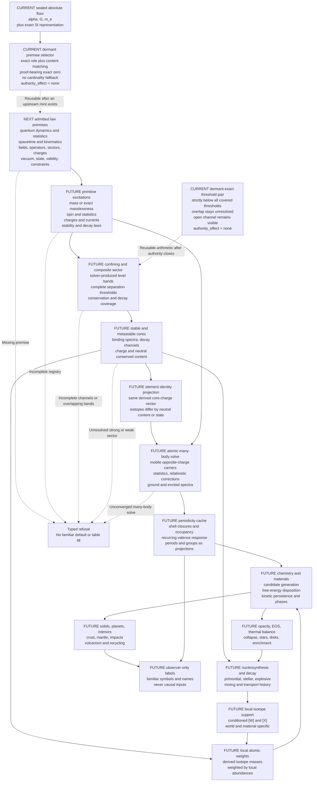

# From the absolute floor to a derived periodic table

Status: architecture and implementation frontier for draft PR #215. `CURRENT`
marks implemented behavior. `NEXT` marks the first bounded physical work.
`FUTURE` remains blocked on the named authority. This page is explanatory and
cannot admit a law, value, species, or world state.

## Current truth

No physical species has emerged. The canonical floor contains three Universal
`[M]` invariants, `alpha`, `G`, and `m_e`. The exact SI definitions are engine
coordinates with no provenance mark or physical freedom. The `m_e` coordinate
does not establish an electron degree of freedom, field, spin, charge,
interaction, stable excitation, or registry membership.

The live physical-registry pair can represent unfamiliar primitive, massless,
and composite species. Production supplies no species-forming law artifacts,
so the registry returns `no_admitted_species_derivation_rules`, zero members,
no support, and no authority effect. No `[W]`, `[X]`, star, element, atom,
planet, or snapshot follows from that refusal.

A dormant claim-scoped selector now closes one part of the next boundary. A
law request identifies each premise by opaque semantic-role and
physical-content identities. A candidate matches only when an upstream
capability binds the same claim, role, content, applicability, validity, and
independent semantic evidence. Sole-candidate, name, ordinal, value-shape, and
catalog-cardinality fallbacks are absent. Exact zero requires a symmetry and
term-exclusion proof object. Production cannot construct a premise capability,
and selector agreement has no authority effect.

`crates/physics/data/periodic_table.toml` is a terrestrial reference cache used
by active-candidate material kernels. It contains authored membership,
terrestrial isotope-weighted standard atomic weights, valence rows, and other
measured columns. It is validation and migration evidence. It is not the
canonical periodicity route, cannot enter `civsim-planet`, and cannot select an
alien or Terran realization.

## The dependency chain



## What each rung must prove

### 1. Law premises

The first live addition is a claim-scoped, role-bound physical-law authority.
It must admit the field content, operator, interaction sector, state,
applicability, validity regime, conservation laws, and semantic roles consumed
by a kernel. A value shape, familiar name, catalog cardinality, citation, or
hardcoded Standard Model graph cannot supply those premises.

The dormant selector now enforces exact role and content matching through two
different algorithms. Adding an unrelated unfamiliar candidate cannot relabel
or displace an existing match. A candidate under the wrong role or content
still fails when it is the only candidate. This establishes selection
mechanics, not scientific admission. The next authority must mint the opaque
upstream capability from complete physical evidence and bind its live canary
transcripts through the watchdog.

The familiar electromagnetic, strong, and weak sectors are one possible
admitted profile. An unfamiliar or thaumic sector follows the same schema and
proof path. No Rust enum of familiar particles or gauge groups defines the
complete physical vocabulary.

Each derived premise carries exact ancestry and independent semantic evidence.
Each irreducible survivor requires derive-first exhaustion, its Buckingham-Pi
budget, Gap Law including the typed Chaos Protocol, Residual Law, one unique
residual slot, owner review, and an independent watchdog. The four tiers and
seven marks, `[D]`, `[M]`, `[E]`, `[C]`, `[A]`, `[W]`, and `[X]`, account for
the result but never authorize it.

### 2. Primitive excitations

The admitted laws must produce a complete registry of stable or applicable
field excitations. Each member needs content identity, mass or a replayable
exact-masslessness proof, spin and statistics, conserved charges and currents,
active sectors, state, validity, uncertainty, stability, transition laws, and
dependency ancestry.

This is where an electron-like carrier could emerge. The current `m_e` floor
coordinate could become one input to its mass proof only after the degree of
freedom and every other required role are independently established.

### 3. Composite and nuclear states

A bound-state solver produces closed level bands and every physically allowed
separation or decay threshold under the admitted laws. Conservation rules
eliminate forbidden channels. The complete candidate band must lie strictly
below every covered separation threshold before the exact threshold kernel can
report a bound disposition. A touching or overlapping band remains
near-degenerate under the Gap Law. A band above a threshold exposes an open
channel.

PR #215 now contains two independent exact threshold algorithms as a dormant
diagnostic. They canonicalize channel identity, reject missing or duplicate
coverage, preserve overlap, and emit `authority_effect=none`. They cannot prove
that the solver is correct or that its channel census is complete. Production
has no coverage-proof constructor, so this kernel cannot mint a species.

For a Terran validation profile, the nuclear rung needs a strong-like
confining sector, constituent masses and couplings, composite binding spectra,
and a weak-like transition sector for beta stability and decay. These are
physical dependencies, not a license to import an isotope list.

### 4. Elements and isotopes

Element identity derives from the conserved core-charge vector relative to the
quantized charge carried by mobile opposite-charge excitations. A symbol,
name, or authored atomic number is presentation metadata. Isotopes share the
derived core-charge identity and differ in neutral conserved content or
internal bound state.

This definition admits alien chemistry. It does not assume a single electric
charge axis, one neutral-content axis, a familiar nucleus, or a maximum element
count. If the admitted physics produces no analogous core-charge partition,
the periodic-table projection is inapplicable and the system exposes its own
derived species organization.

### 5. Atomic spectra and periodicity

Atoms combine a derived core state with light opposite-charge carriers. A
relativistic many-body solver applies the admitted interactions and statistics,
then emits converged ground and excited energy bands with residual,
uncertainty, and validity receipts. Antisymmetrization, screening,
near-degeneracy, and level crossings stay inside the solve rather than an
exception table.

Periods and groups are read-only projections over recurring shell closures,
occupancy, and valence response in those spectra. Familiar symbols and names
belong only in the viewer. Ambiguous level orderings remain explicit branches
or refusals. They are never repaired with an authored exception list.

### 6. Abundances and atomic weights

The periodic structure does not contain isotope abundances. Primordial
nucleosynthesis, stellar burning, explosive channels, decay, ejection,
transport, mixing, and planet formation generate local isotope support as
`[W]` and `[X]`.

An atomic weight is therefore a material-local reduction over derived isotope
masses and local isotope number fractions. A terrestrial standard atomic
weight is validation evidence for a Terran hindcast, not a universal floor
value. The same derived element can have different atomic weights in different
reservoirs without changing the laws or element identity.

### 7. Chemistry, stars, and planets

The derived element and species caches feed a candidate generator, exact or
certified free-energy disposition, kinetic persistence, phase structure,
opacity, equation of state, and material properties. Those outputs unlock the
existing stellar and planetary candidate kernels in dependency order:
thermal balance, collapse, stars, disks, nucleosynthesis, solid inventories,
assembly, differentiation, crust, mantle, impacts, volcanism, atmosphere, and
recycling.

The viewer receives only immutable outputs. Asking for a Terran system is a
search or conditioning request over completed lawful results. It cannot alter
the floor, species roster, abundance history, or physical solve.

## Unfamiliar material acceptance canary

The end-to-end path carries a standing falsifier: an unfamiliar matter sector
must be able to produce a stable or metastable many-body phase with derived
bulk response even when it has no terrestrial element, isotope, mineral,
crystal, or material-table identity. The canary advances through the same
sequence as every other material:

```text
admitted unfamiliar law premises
  -> primitive excitations
  -> bound composite species
  -> many-body phase and transition solve
  -> derived transport, elastic, optical, and thermal response
  -> stellar or planetary material inventory
  -> neutral viewer label
```

The new selector test supplies arbitrary role and content identities for a
material precursor, including one proof-bearing exact-zero premise, and both
algorithms select the same seven capabilities. This is a structural
generality canary. It does not admit those synthetic capabilities into
production. The production canary passes only when every arrow above carries
its real derivation and authority receipts. If admitted physics does not
support such a phase, refusal is valid; no desired fantasy property may feed
back into the law, species, or material solve.

## Deterministic execution on consumer hardware

The universe does not run a full lattice, nuclear, and atomic many-body solve
for every viewer request. Expensive solvers run as deterministic offline or
amortized builders. They emit content-addressed, floor-bound cache artifacts
with convergence, interval, conservation, residual, validity, provenance, and
independent-checker receipts.

Runtime loads only the cache slice whose exact law, floor, and state bindings
match the local region. It verifies the receipt, evolves local abundances and
chemistry, and refuses a cache produced under another physical profile.
Scalable causal kernels use deterministic integer or fixed-point arithmetic.
Wide exact rational or integer arithmetic certifies cache construction.
Floating point remains confirmation-only.

## Ordered implementation slices

1. **Law-premise selection.** DONE AS A DORMANT NON-AUTHORIZING PAIR: exact
   claim, role, content, applicability, validity, and semantic-evidence
   bindings select one premise without a familiar name, value-shape, ordinal,
   or cardinality fallback. Exact zero carries a symmetry and exclusion proof
   object. An unfamiliar material precursor passes the same structural path.
2. **Law-premise capability mint.** Admit one minimal quantum and interaction
   claim through distinct producer and watchdog semantics. Acceptance requires
   complete derived or irreducible premise authority, live canary transcripts,
   no familiar dispatch, and no production species.
3. **First primitive excitation.** Produce one content-bound member with mass
   or exact masslessness, state, charges, statistics, stability, validity, and
   complete ancestry. Acceptance requires the physical registry to admit that
   member without claiming global registry coverage.
4. **Bound-state evidence integration.** Bind solver-produced level bands,
   complete threshold coverage, conservation, and decay channels into the
   physical registry. Promote the dormant threshold pair only after live
   canaries and the authority-watchdog receipt exist.
5. **Complete primitive registry and support.** Prove membership coverage,
   conditioned support, explicit zeros, normalization, resource bounds, and
   exact mean particle mass.
6. **Composite core profile.** Add the confining and transition sectors needed
   to enumerate stable and metastable cores for one admitted profile, while
   leaving unfamiliar sectors open.
7. **Atomic solver cache.** Produce certified spectra and shell projections
   without an exception list.
8. **Nucleosynthesis and abundance history.** Generate local isotope support,
   atomic weights, opacity, and chemistry from the stellar and disk history.
9. **Candidate-substrate migration.** Replace each consumer of the terrestrial
   reference table with a typed derived cache adapter, one invariant at a time.
   The reference table remains validation-only until no canonical consumer
   needs it.

The next code target is slice 2. The selection pair and exact threshold pair
landed early because both are value-free with respect to the current run. They
close false proof shapes without claiming scientific truth and give the first
law authority and later bound-state solver precise downstream contracts.
